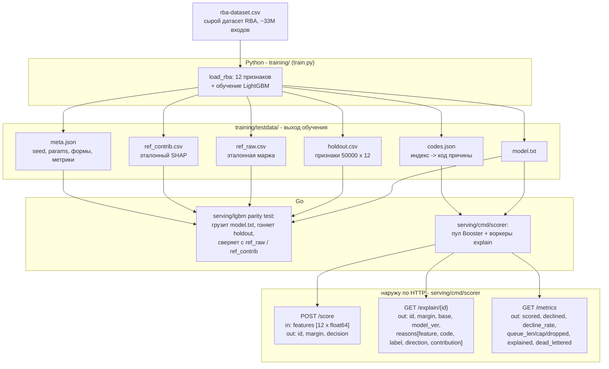

# go-lgbm-serving

[](https://github.com/danilkiff/go-lgbm-serving/actions/workflows/ci.yml)

Подача обученной в Python модели **LightGBM** из **Go** через cgo, с **нативными
кодами причин SHAP** и harness **численного паритета**. Домен: **сессионный фрод
/ risk-based authentication (RBA)**.

Это исследовательский proof-of-concept, не фреймворк. Он отвечает на один вопрос
конкретно, кодом и измерениями:

> Может ли Go подавать древесную ансамблевую модель сессионного фрода, обученную в
> Python, воспроизводить её оценки и выдавать объяснимые коды причин
> на каждое решение - с задержкой и конкуренцией, нужными скореру входов (RBA)?

Полный рационал - цель, метод, рассмотренные альтернативы и измеренный результат
(включая то, почему нативный SHAP достижим для LightGBM/XGBoost, но не для
CatBoost/ONNX) - в [docs/DESIGN.md](docs/DESIGN.md); этот README - сводка.

## Структура репозитория

Монорепо по подсистемам - верхний уровень читается как поток данных (обучение ->
подача), а не свалкой языков. У `training/` и `serving/` свой самодокументируемый
Makefile (`make -C training help`, `make -C serving help`):

- `training/` - Python: построение признаков, обучение LightGBM и выгрузка
  артефактов с эталонами (`train.py`), helper загрузки RBA (`fetch_rba.sh`),
  парный дамп паритета (`xparity.py`), генерируемые эталоны в `testdata/` (не
  коммитятся; `make -C training data`). Среда uv (`pyproject.toml`).
- `serving/` - Go-модуль: cgo-обёртка инференса (`lgbm/`), конвейер
  decline->explain (`pipeline/`), каталог кодов причин (`reasoncode/`), бинарники
  (`cmd/scorer`, `cmd/dump`), примеры запросов (`clients/http/`, JetBrains HTTP
  Client) и закоммиченная RBA-фикстура (`fixtures/` - model.txt+codes.json, чтобы
  примеры работали без обучения). Здесь `go.mod`; команды - `make -C serving ...`.
- `docs/DESIGN.md` - рационал (цель/метод/альтернативы/результат).

cgo линкует ту же `lib_lightgbm` из venv в `training/.venv`, поэтому `serving/` и
`training/` - соседи по дизайну (путь зашит в `serving/lgbm/lgbm.go`).

## Что доказано и что нет

**Доказано** (инженерия, путь подачи):

- Go (cgo -> C API LightGBM) воспроизводит выход Python-модели.
- Нативные вклады **SHAP** идут прямо из того же предиктора
  (`C_API_PREDICT_CONTRIB`), а не из повторной реализации.
- harness паритета ловит дрейф оценки, SHAP и порядка кодов причин в CI.

**Не доказано**: качество детекции атак в реальном мире. Данные - датасет RBA,
**синтезированные** (авторы прямо пишут: правдоподобны, но искусственны, не для
боевых IDS). Это доказательство **пути подачи и корректности кодов причин**, а не
эффективности модели. Метрика ниже (ROC-AUC примерно 0.70) - честная,
поведенческая, без подгонки.

## Данные и признаки

- **Датасет RBA** (Wiefling et al., "Pump Up Password Security!"): примерно
  31.3M попыток входа, 3.3M пользователей, крупный SSO в Норвегии, февраль 2020 -
  февраль 2021. Лицензия CC BY 4.0; синтезированный, в репозитории не хранится.
- **Цель**: `Is Attack IP` (вход с атакующего IP) - примерно 9.9% положительных.
  Это сигнал сессионного фрода на уровне входа; `Is Account Takeover` на порядки
  реже и доступен флагом `--target ato`.
- **Признаки - числовые, поведенческие (RBA-новизна)**, считаются на пользователя
  в хронологическом порядке (причинно, без утечки метки): время с прошлого входа,
  число прошлых входов, час и день недели, успех входа, RTT, новизна страны /
  города / ASN / ОС / браузера / устройства для пользователя.
- **Сознательно выброшены** глобально-частотные признаки страны/ASN: метка
  `Is Attack IP` выводится из IP, а страна/ASN тоже из IP, поэтому их частота
  почти напрямую читает метку (в эксперименте давала 98.5% gain - тривиальный
  шорткат, а не объяснимый сигнал). Это решение выводится из комментариев в
  [`training/train.py`](training/train.py).

## Результат: паритет на одной сборке битоточный

На одной машине и одной сборке `lib_lightgbm` Go совпадает с Python точно на
holdout из 50000 входов (одинаково на Linux x86_64 и macOS arm64):

| Проверка | Результат |
| --- | --- |
| Сырая маржа (Go против Python `predict(raw_score=True)`) | maxD = `0.000e+00` |
| Вклады SHAP (Go против Python `predict(pred_contrib=True)`) | maxD = `0.000e+00` |
| Инвариант sum(contrib) = сырая маржа | maxD = `1.51e-14` |
| Несовпадения порядка топ-3 кодов причин | `0 / 50000` |
| Смены решения (знак сырой маржи) | `0` |

**Кросс-платформенно, измерено** (macOS arm64 против Linux x86_64, тот же
`model.txt`, LightGBM 4.6.0, float64): сырая маржа **битоточно идентична**
(maxD = `0`, `0` смен решения); вклады SHAP расходятся лишь в последнем бите
(maxD = `7.8e-16`), порядок топ-3 кодов причин идентичен. Детерминированный
инференс фиксированной модели битостабилен между архитектурами, далеко ниже
гранулярности решения.

## Качество модели (вторично; путь подачи важнее)

На holdout из 50000 входов (4963 положительных, base rate 9.9%):

| Метрика | Значение |
| --- | --- |
| ROC-AUC | `0.703` |
| PR-AUC (AP) | `0.190` (база `0.099`) |
| precision при пороге margin>0 | `0.90` |
| recall при пороге margin>0 | `0.004` |

Важности (gain): время с прошлого входа `33%`, число прошлых входов `21%`, час
`16%`, успех входа `10%`, RTT `8%`, новизна города/браузера/устройства/ОС/ASN/
страны суммарно примерно `11%`. Ни один признак не доминирует - сигнал
осмысленный и поведенческий.

Порог `margin>0` (prob>0.5) для base rate 9.9% крайне консервативен (recall
0.4%): рабочую точку задают по целевому FPR/recall, порог сервиса настраивается
флагом `-threshold`. ROC-AUC - оценка без привязки к порогу.

Цифры выше - сводка из `meta.json`, которую пишет `train.py`. Углублённая
валидация качества (сплиты, калибровка, дрейф, базлайны, срезы) - вне охвата:
репозиторий доказывает путь подачи и корректность кодов причин, а не эффективность
детекции.

## Архитектура

- Сторона Python (`training/train.py`) строит поведенческие признаки из сырого
  датасета RBA, обучает LightGBM и выгружает `model.txt`, матрицу holdout,
  эталонные предсказания + SHAP и каталог кодов причин в `training/testdata/`.
- Сторона Go (`serving/lgbm/`) загружает тот же `model.txt` через C API.
- **Приём для тесного паритета**: cgo линкуется с той же `lib_lightgbm`, что лежит
  внутри uv-venv Python. Go и Python исполняют один и тот же нативный предиктор -
  паритет настолько точен, насколько позволяет платформа.
- Прототипы C-ABI объявлены **вручную** в преамбуле cgo; мы *не* делаем
  `#include <LightGBM/c_api.h>` (он тянет C++/Arrow, которые cgo не компилирует).

Поток данных - вход и выход обеих сторон и то, что сервис отдаёт наружу
по HTTP:



- **Python** (`train.py`): вход - `rba-dataset.csv`; выход - шесть артефактов в `training/testdata/`.
- **Go**: parity-тест читает пять из них (`model.txt`, `holdout.csv`, `ref_raw.csv`, `ref_contrib.csv`, `meta.json`) и сверяет числа; `serving/cmd/scorer` грузит `model.txt` и `codes.json` и обслуживает HTTP.

## Конвейер decline->explain

Горячий путь скорит вход и решает (пропустить / запросить доп. фактор или
отклонить). Для отклонений он выкладывает событие **вне горячего пути**; нативный
SHAP (коды причин: новое устройство, необычный час, долгий перерыв и т.п.) считает
асинхронный воркер - шаг SHAP (примерно в 58 раз дороже скоринга) никогда не идёт
инлайн. Эндпойнты: `POST /score`, `GET /explain/{id}`, `GET /metrics`; мягкое
завершение сливает очередь объяснений. Каталог adverse-action кодов задаётся через
`-codes <файл>` (генерируется `train.py` в `training/testdata/codes.json`). Готовые
примеры запросов к этим эндпойнтам - в `serving/clients/http/scorer.http`
(JetBrains HTTP Client). Запустить без обучения/скачивания, на закоммиченной фикстуре:
`go -C serving run ./cmd/scorer -model fixtures/model.txt -codes fixtures/codes.json`
(коротко - `make -C serving run`; см. `serving/fixtures/`).

## Быстрый старт

Требуется: Go >= 1.24, [uv](https://docs.astral.sh/uv/) и рантайм OpenMP
(macOS: `brew install libomp`; Linux: `libgomp`, обычно есть).

```sh
make -C training data      # синтетика -> training/testdata/ (для CI, без скачивания)
make -C training data-rba  # скачать датасет RBA (~9 ГБ) и обучить (нужен kaggle CLI)
make -C serving test       # паритет + юнит-тесты
make -C serving bench      # задержка / пропускная способность
make -C training help      # полный список целей (так же для serving)
```

`make -C serving print-env` проверяет путь к нативной библиотеке, с которой линкуется cgo.

## Нативные грабли (реальная цена cgo + нативной либы)

- **Рантайм OpenMP**: `lib_lightgbm` линкует `@rpath/libomp.dylib`. Без него
  библиотека не сделает `dlopen`. Директива `#cgo darwin` в `serving/lgbm/lgbm.go`
  добавляет rpath к brew libomp на macOS.
- **Пиннинг потоков**: предсказание передаёт `num_threads=1`. Порядок редукции
  float в многопоточном OpenMP - источник недетерминизма; параллелизм держим на
  уровне Go (пул Booster), а не внутри нативного вызова predict.
- **Минимальная версия**: однострочный predict в C API не был потокобезопасен в
  LightGBM 3.0.0-3.1.1 (ключевал буфер по `omp_get_thread_num()`, который для
  не-OpenMP потоков Go возвращает 0 - молчаливая гонка). Исправлено в
  [#3771](https://github.com/microsoft/LightGBM/pull/3771) (>= v3.2.0). Репозиторий
  фиксирует LightGBM 4.x.

## Численный паритет

`deterministic=true, force_row_wise=true` плюс фиксированное число потоков -
воспроизводимое обучение при одном числе потоков; обучение их использует.
Инференс пинится к `num_threads=1` (в `serving/lgbm/lgbm.go`) - это и есть критичная для
паритета настройка. Битоточный паритет держится на одной сборке либы и платформе.
Кросс-платформенно остаток *измеряется*, а не предполагается: для детерминированного
float64-инференса фиксированной модели сырая маржа вышла битоточно идентичной
arm64 против x86_64, SHAP разошёлся лишь на `7.8e-16`. harness проверяет не только
отклонение оценки, но и **смены решения** и **устойчивость топ-K кодов причин**,
поэтому любой дрейф будет пойман, а не принят на веру.

## Производительность

Задержка одиночной строки и пропускная способность пула (`make bench`; Linux
x86_64, AMD Ryzen 9 5950X, 32 потока; модель 12 признаков / 200 деревьев):

| Бенчмарк | нс/оп | Примечание |
| --- | ---: | --- |
| `PredictRaw` (1 горутина) | ~16200 | обычный скоринг |
| `PredictContrib` (1 горутина) | ~943000 | нативный SHAP - **примерно в 58 раз дороже скоринга** |
| `PredictRaw` через `Pool` (параллельно) | ~907 | ~18x пропускной, без гонок |

Стоимость SHAP в 58 раз - количественный аргумент за архитектуру: **скорить каждый
вход дёшево, считать коды причин вне горячего пути и только для отклонений**. Пул
даёт настоящий параллелизм, потому что каждая горутина берёт свой хэндл; тест
конкуренции гоняет 32 тысячи предсказаний через пул под `-race` без расхождений.

## Статус / дорожная карта

- [x] Обучение на Python: поведенческие RBA-признаки + эталонные артефакты (синтетика для CI; адаптер RBA)
- [x] cgo-подача из Go: сырая маржа + нативные вклады SHAP
- [x] harness паритета: оценка, SHAP, инвариант суммы, устойчивость топ-K кодов причин
- [x] Пул Booster + тест конкуренции (32k предсказаний, без гонок; хэндл на горутину)
- [x] Бенчмарки: нативный SHAP примерно в 58 раз дороже скоринга; пул ~18x пропускной
- [x] Кросс-платформенный паритет измерен: arm64 против x86_64 сырая маржа битоточна, SHAP отклонение <= 7.8e-16
- [x] CI: GitHub Actions собирает нативную либу (uv wheel) + паритет / race / bench на Linux
- [x] Адаптер датасета RBA (`--dataset rba`) + хелпер загрузки через kaggle
- [x] Конвейер decline->explain: `/score`, асинхронные коды причин, `/explain/{id}`, `/metrics`, мягкое завершение

## Решения

Ключевые архитектурные решения изложены в [docs/DESIGN.md](docs/DESIGN.md) (цель,
метод, альтернативы, результат) и выводятся из комментариев непосредственно в коде:
выбор модели и нативный TreeSHAP, путь подачи через cgo, механизм биндинга, harness
паритета, конкуренция, поток кодов причин вне горячего пути, выбор цели и
поведенческих признаков RBA без утечки.

## Лицензия

[MIT](LICENSE).
